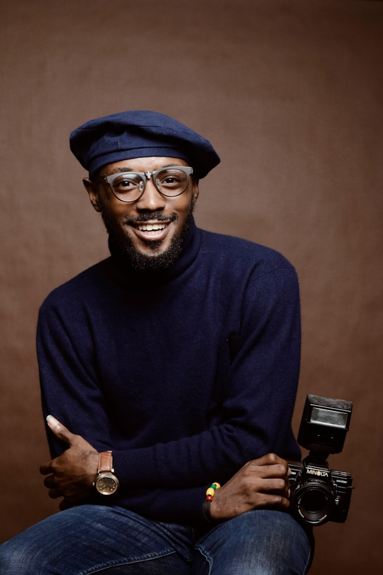

# Face Anonymizer
+ Tools
  + python
+ Framework
  + Mediapipe
  + OpenCv


## Installation / Import Requirements 
Add the following texts into `requirement.txt`
```txt
opencv-python==4.10.0.84
mediapipe==0.10.18
```
Then run `pip install -r requirement.txt`


> **Note:** In the `main.py` file make sure to include these modules/libraries:
```py
import cv2 as cv
import os
import mediapipe as mp
import argparse
```

## Face Detection
[Mediapipe Face Detection](https://mediapipe.readthedocs.io/en/latest/solutions/face_detection.html)
> **Note:** Mediapipe `FaceDetection` parameters
> + `model_selector` is an integer ranging from `0` to `1`. By default it's set to `0` if not specified.
>   + `0` - short-range model that <u>works best for faces within 2 meters</u> from the camera
>   + `1` - full-range model <u>best for faces within 5 meters</u>
>
> + `min_detection_confidence` value (`[0.0, 1.0]`) from the face detection model for the detection to be considered successful. Default to `0.5`

```py
# Detect faces
mp_face_detection = mp.solutions.face_detection
```

---
#### Image Processing
> **Note:** We will an image processing function to return a face that's blurred 

+ Input:
  + `img`
    + For an image use the original image
    + For a video use each frame 
    + For a webcam use each frame
  + `face_detection`
    + [Mediapipe `FaceDetection`](https://mediapipe.readthedocs.io/en/latest/solutions/face_detection.html) a open source face detection algorithm that will be using detect faces then blur them
```py
def process_img(img, face_detection):
    H, W, _ = img.shape
    img_rgb = cv.cvtColor(img, cv.COLOR_BGR2RGB)
    out = face_detection.process(img_rgb)

    if out.detections is not None:
        for detection in out.detections:
            location_data = detection.location_data
            bbox = location_data.relative_bounding_box

            x1, y1, w, h = bbox.xmin, bbox.ymin, bbox.width, bbox.height

            # This is needed but why?
            x1, y1, w, h = int(x1 * W), int(y1 * H), int(w * W), int(h * H)

            # Blur faces
            img[y1 : y1 + h, x1 : x1 + w, :] = cv.blur(
                img[y1 : y1 + h, x1 : x1 + w, :], (40, 40)
            )

    return img
```
#### Deallocate Memory
> **Note:** We will be using this function to release **_webcam_** and **_video_** to **deallocate memory** so we can free up


```py
def deallocate_memory(videoCampture):
    videoCampture.release()
    cv.destroyAllWindows()
    return
```

---

### Image Face Detection
```py
    if args.mode in ["image"]:
        print(f"Image mode: {args.mode}")
        # Read image
        img = cv.imread(os.path.join(args.filePath, "face.jpg"))
        blur_img = process_img(img, face_detection)

        cv.imshow("video blurred", blur_img)
        cv.waitKey(0)
        cv.destroyAllWindows()

        # Save image
        cv.imwrite(os.path.join(output_dir, "blur_img.jpg"), blur_img)
```

**Before** image blur | **After** image blur
:---: | :---: |
 |  |


### Video Face Detection
```py

args.mode in ["video"]:
        print(f"Video mode: {args.mode}")
        cap = cv.VideoCapture(os.path.join(args.filePath, "face.mp4"))
        ret, frame = cap.read()
```

```py
        # Inputs for cv2.VideoWriter
        output_file_location = os.path.join(output_dir, "output.mp4")

        # 4-character code of codec used to compress the frames
        codec = cv.VideoWriter_fourcc(*"MP4V")

        # frame rate of the created stream
        fps = 25

        # (width, height) - size of video frames
        frameSize = (frame.shape[1], frame.shape[0])   
```

```py
        output_video = cv.VideoWriter(output_file_location, codec, fps, frameSize)

        while ret:
            frame = process_img(frame, face_detection)
            output_video.write(frame)
            ret, frame = cap.read()

        deallocate_memory(cap)
```

**Before** image blur | **After** image blur
:---:|:---:|
 | 


### Webcam Face Detection

```py
        if args.mode in ["webcam"]:
        webcam = cv.VideoCapture(1, cv.CAP_DSHOW)
        ret, frame = webcam.read()

        while ret:
            frame = process_img(frame, face_detection)
            cv.imshow("webcam", frame)

            # Break if 33ms has past or 'q' is selected
            if cv.waitKey(33) & 0xFF == ord("q"):
                break
            
            ret, frame = webcam.read()

        deallocate_memory(webcam)
```


## To Do List
+ [X] Finish creating a bounding box 
+ [x] Save the blurred image file
+ [x] Finish blurring the `face.mp4`
+ [x] Troubleshoot the video blurring
+ [x] Blur webcam
+ [ ] Complete README file 

### Research
+ [ ] How does img array works?
+ [ ] Why is line 27 in `main.py` needed? And how does it work?

## Resources/References
+ Photo by <a href="https://unsplash.com/@princearkman?utm_content=creditCopyText&utm_medium=referral&utm_source=unsplash">Prince Akachi</a> on <a href="https://unsplash.com/photos/smiling-man-wearing-black-turtleneck-shirt-holding-camrea-4Yv84VgQkRM?utm_content=creditCopyText&utm_medium=referral&utm_source=unsplash">Unsplash</a>
      
+ Video by [Mikhail Nilov from Pexels:](https://www.pexels.com/video/a-woman-talking-at-the-podium-8731389/)

+ **OpenCV** - [cv2.VideoWriter()](https://docs.opencv.org/4.x/dd/d9e/classcv_1_1VideoWriter.html)